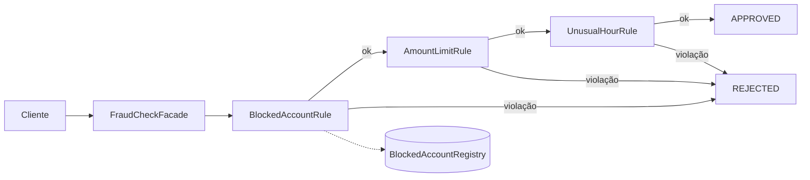
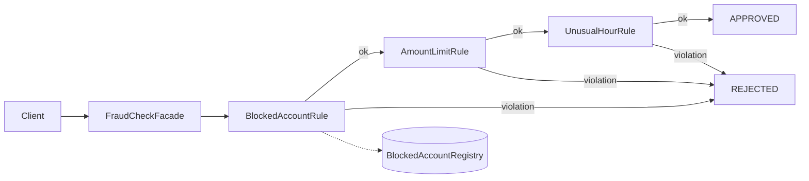

# Fraud Check Patterns


🇧🇷 [Português](#português) | 🇺🇸 [English](#english)

---

## Português

### Sobre

Análise antifraude de transações construída para demonstrar padrões de projeto, desenvolvida como desafio de projeto da DIO. O mesmo domínio é implementado duas vezes: em **Java puro**, onde cada padrão é escrito à mão, e com **Spring Boot**, onde parte do trabalho passa para o container. A comparação entre as duas versões é o foco do repositório.

Uma transação passa por uma cadeia de regras. A primeira regra violada rejeita a transação com o motivo; se nenhuma for violada, ela é aprovada.

| Regra | Rejeita quando |
|---|---|
| Conta bloqueada | a conta está na lista de bloqueio |
| Limite de valor | o valor ultrapassa R$ 5.000,00 |
| Horário atípico | a transação ocorre entre 22:00 e 06:00 |

### Fluxo da análise



### Padrões aplicados

- **Chain of Responsibility**: cada regra é um elo da cadeia e decide se rejeita a transação ou a repassa adiante. Novas regras entram sem alterar as existentes, e a avaliação para na primeira violação.
- **Facade**: `FraudCheckFacade` expõe um único método, `analyze(transaction)`, e esconde do cliente quantas regras existem, em que ordem rodam e como se conectam.
- **Singleton**: `BlockedAccountRegistry` é a lista de bloqueio, compartilhada por toda a aplicação numa única instância.
- **Template Method** (bônus, no Java puro): o método `check` da classe base é `final` e concentra o encadeamento; cada regra implementa apenas `findViolation`. Assim nenhuma regra consegue esquecer de chamar a próxima.

### Java puro × Spring Boot

| Aspecto | Java puro (`java-pure`) | Spring Boot (`spring-api`) |
|---|---|---|
| Chain of Responsibility | Classe abstrata; cada regra guarda a próxima (`linkWith`) | Interface; o container injeta todas as regras numa lista ordenada por `@Order` |
| Montagem da cadeia | Manual, em `buildChain` | Automática; a ordem fica centralizada em `RuleOrder` |
| Facade | Conhece e instancia as regras concretas | Conhece só a interface; uma regra nova é só um novo `@Component` |
| Singleton | Construtor privado, `getInstance()` e holder idiom | Escopo singleton padrão dos beans, sem código extra |
| Configuração | Constantes no código | `application.properties`, validado na inicialização |
| Testes | Estado global exige limpeza com `@AfterEach`; dublês como classes | Instância nova por teste; dublês como lambdas |

O ponto central da comparação: os padrões continuam presentes no Spring, mas a infraestrutura de cada um (montar a cadeia, garantir instância única, injetar dependências) passa para o container. O código que sobra é só a regra de negócio.

### Estrutura

```
fraud-check-patterns/
├── java-pure/     # Padrões implementados à mão, demonstração via console
└── spring-api/    # Mesmo domínio como API REST com Spring Boot
```

### Como executar

Requisito: **JDK 21+**. Não é preciso instalar o Maven, porque cada módulo inclui o Maven Wrapper. No Windows, use `.\mvnw.cmd` no lugar de `./mvnw`.

**Java puro**

```bash
cd java-pure
./mvnw test                 # 18 testes
./mvnw -q compile exec:java # demonstração
```

Saída da demonstração:

```
tx-1 | APPROVED | No fraud rule violated
tx-2 | REJECTED | Account is blocked
tx-3 | REJECTED | Amount exceeds limit of 5000.00
tx-4 | REJECTED | Transaction at unusual hour
```

**Spring Boot**

```bash
cd spring-api
./mvnw test             # 17 testes
./mvnw spring-boot:run  # API em http://localhost:8080
```

Exemplo de requisição:

```bash
curl -X POST http://localhost:8080/api/fraud-checks \
  -H "Content-Type: application/json" \
  -d '{"id": "tx-1", "accountId": "acc-100", "amount": 250.00, "timestamp": "2026-10-08T14:30:00"}'
```

```json
{"transactionId": "tx-1", "decision": "APPROVED", "reason": "No fraud rule violated"}
```

Entradas inválidas retornam `400` no formato Problem Details (RFC 9457):

```json
{"title": "Bad Request", "status": 400, "detail": "Request validation failed", "errors": {"amount": "must be greater than 0"}}
```

### Configuração

Os limites ficam em `spring-api/src/main/resources/application.properties`. A aplicação não inicia se algum valor obrigatório estiver ausente ou inválido.

```properties
fraud-check.amount-limit=5000.00
fraud-check.unusual-hours-start=22:00
fraud-check.unusual-hours-end=06:00
fraud-check.blocked-account-ids=acc-blocked
```

### Decisões de design e segurança

- **`BigDecimal` para valores monetários**, evitando erros de arredondamento de `double`.
- **Domínio sempre válido**: `Transaction` valida seus dados no construtor, então uma transação inválida nunca chega às regras.
- **Validação de entrada como defesa**: IDs aceitam apenas letras, números e hífen, com tamanho máximo, o que impede *log injection* por quebras de linha e payloads excessivos.
- **Erros sem vazamento de detalhes internos**: JSON malformado retorna uma mensagem genérica, sem expor classes ou trechos do payload.
- **Idioma fixo da API**: mensagens sempre em inglês, independentemente do idioma do cliente.
- **Rejeição não é erro HTTP**: uma transação rejeitada retorna `200`, porque a análise foi concluída com sucesso; `400` fica reservado para requisições inválidas.

### Autor

Arnald Souza: [GitHub](https://github.com/ArnaldSouza)

---

## English

### About

Transaction fraud check built to demonstrate design patterns, developed as a DIO project challenge. The same domain is implemented twice: in **plain Java**, where each pattern is written by hand, and with **Spring Boot**, where part of the work moves to the container. Comparing both versions is the focus of this repository.

A transaction goes through a chain of rules. The first violated rule rejects the transaction with its reason; if none is violated, the transaction is approved.

| Rule | Rejects when |
|---|---|
| Blocked account | the account is on the blocklist |
| Amount limit | the amount exceeds 5,000.00 |
| Unusual hour | the transaction happens between 22:00 and 06:00 |

### Analysis flow



### Patterns applied

- **Chain of Responsibility**: each rule is a link in the chain and either rejects the transaction or passes it along. New rules are added without changing existing ones, and evaluation stops at the first violation.
- **Facade**: `FraudCheckFacade` exposes a single method, `analyze(transaction)`, hiding from clients how many rules exist, in which order they run, and how they are connected.
- **Singleton**: `BlockedAccountRegistry` is the blocklist, shared across the application as a single instance.
- **Template Method** (bonus, plain Java): the base class `check` method is `final` and owns the chaining logic; each rule implements only `findViolation`, so no rule can forget to call the next one.

### Plain Java vs. Spring Boot

| Aspect | Plain Java (`java-pure`) | Spring Boot (`spring-api`) |
|---|---|---|
| Chain of Responsibility | Abstract class; each rule holds the next one (`linkWith`) | Interface; the container injects all rules as a list ordered by `@Order` |
| Chain assembly | Manual, in `buildChain` | Automatic; the order is centralized in `RuleOrder` |
| Facade | Knows and instantiates the concrete rules | Knows only the interface; a new rule is just a new `@Component` |
| Singleton | Private constructor, `getInstance()` and holder idiom | Default singleton scope of beans, no extra code |
| Configuration | Constants in code | `application.properties`, validated at startup |
| Tests | Global state requires `@AfterEach` cleanup; test doubles as classes | Fresh instance per test; test doubles as lambdas |

The key takeaway: the patterns are still present in Spring, but the infrastructure behind each one (assembling the chain, guaranteeing a single instance, injecting dependencies) moves to the container. What remains is pure business logic.

### Structure

```
fraud-check-patterns/
├── java-pure/     # Hand-written patterns, console demo
└── spring-api/    # Same domain as a REST API with Spring Boot
```

### Running

Requirement: **JDK 21+**. No Maven installation is needed, since each module ships the Maven Wrapper. On Windows, use `.\mvnw.cmd` instead of `./mvnw`.

**Plain Java**

```bash
cd java-pure
./mvnw test                 # 18 tests
./mvnw -q compile exec:java # demo
```

Demo output:

```
tx-1 | APPROVED | No fraud rule violated
tx-2 | REJECTED | Account is blocked
tx-3 | REJECTED | Amount exceeds limit of 5000.00
tx-4 | REJECTED | Transaction at unusual hour
```

**Spring Boot**

```bash
cd spring-api
./mvnw test             # 17 tests
./mvnw spring-boot:run  # API at http://localhost:8080
```

Sample request:

```bash
curl -X POST http://localhost:8080/api/fraud-checks \
  -H "Content-Type: application/json" \
  -d '{"id": "tx-1", "accountId": "acc-100", "amount": 250.00, "timestamp": "2026-10-08T14:30:00"}'
```

```json
{"transactionId": "tx-1", "decision": "APPROVED", "reason": "No fraud rule violated"}
```

Invalid input returns `400` in Problem Details format (RFC 9457):

```json
{"title": "Bad Request", "status": 400, "detail": "Request validation failed", "errors": {"amount": "must be greater than 0"}}
```

### Configuration

Thresholds live in `spring-api/src/main/resources/application.properties`. The application refuses to start if a required value is missing or invalid.

```properties
fraud-check.amount-limit=5000.00
fraud-check.unusual-hours-start=22:00
fraud-check.unusual-hours-end=06:00
fraud-check.blocked-account-ids=acc-blocked
```

### Design and security decisions

- **`BigDecimal` for monetary values**, avoiding `double` rounding errors.
- **Always-valid domain**: `Transaction` validates its data in the constructor, so an invalid transaction never reaches the rules.
- **Input validation as a defense**: IDs accept only letters, digits, and hyphens, with a maximum length, preventing log injection through line breaks and oversized payloads.
- **Errors without internal details**: malformed JSON returns a generic message, exposing no class names or payload fragments.
- **Fixed API language**: messages are always in English, regardless of the client's language.
- **Rejection is not an HTTP error**: a rejected transaction returns `200`, since the analysis completed successfully; `400` is reserved for invalid requests.

### Author

Arnald Souza: [GitHub](https://github.com/ArnaldSouza)